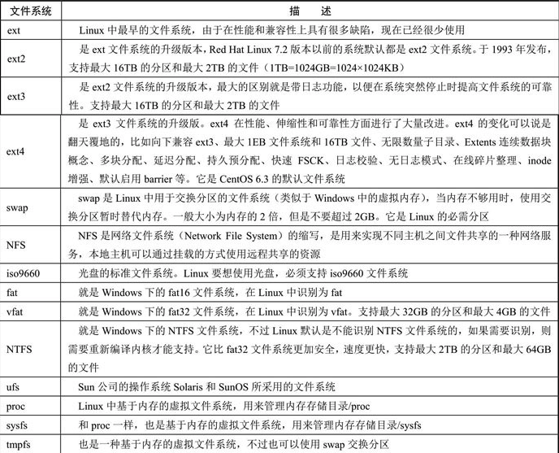

## 文件管理 ##

Linux的文件管理是什么？包括那些内容？

与Windows的文件有什么区别和相同的地方？

在日常使用Linux时候，需要主要那些内容。

### 文件系统 ###

**文件系统是什么？管理什么？Linux支持那些文件系统。**

在Linux中的所有内容都是文件。Linux文件系统中除要保存文件的数据外，还要保存文件的属性，如文件的权限、所有者、属组和时间参数等内容.文件系统把文件的数据和属性分开存放，把文件的数据放入date block中，把文件的属性保存在inode中。

除Linux默认文件系统ext2、ext3和ext4之外，还能支持fat16、fat32、NTFS等Windows文件系统。

### 目录结构 ###
***Linux下的目录介绍***

bin     存放二进制可执行文件,包含系统运行的一些基本指令

boot    存放用于系统引导时使用的各种文件,只有超级管理员权限可以操作该目录

etc     存放系统配置文件，包括系统名称、用户及密码、网络计算机名称、硬盘分区信息等等

home    存放用户文件的根目录，Linux的用户在该文件夹都会生成相应的文件夹（root除外）

lib     存放跟文件系统中的程序运行所需要的共享库及内核模块

media   挂载外部存储器的文件夹（U盘、SD卡、SSD等）

mnt     临时挂载存储器或分区的地方，使用度不高

opt     编译软件的目录；编译软件后应用程序会在/opt/bin 、/opt/lib出现

root    超级用户目录

run     系统运行时候用于存储临时数据，不要轻易操作

sbin    与/bin类似，但它包含的应用程序只有root才能执行；通常包括软件安装、删除等工具。普通用户可以通过sudo命令执行

usr     用于存放共享的系统资源,/usr/bin 包含用户自己安装和用于工作的软件

srv     包含服务器的数据，像web服务器、ftp服务器都在该目录下保存相关数据和文件

sys     与/proc 和 /dev 的虚拟目录类似，它还包含连接到计算机的设备的信息

var     用于存放运行时需要改变数据的文件，同时，/var 目录包含了放在 /var/log 子目录的日志文件之类。日志是记录系统中发生的事件的文件。

--------

### 文件命名规则 ###

***命名规则***

	文件名不应该超过255个字符
	
	使用英文大小写字母、数字、下划线、点这样的符号

***扩展名***

	与Windows不同，在Linux系统下文件的扩展名是可选的。

***隐藏文件***

	以点开头的文件在Linux系统中是隐藏文件;通过命令ls -a可以查看。

### 文件系统常用的命令 ###
    df
    du
    fdisk
    mount 
    umount 

