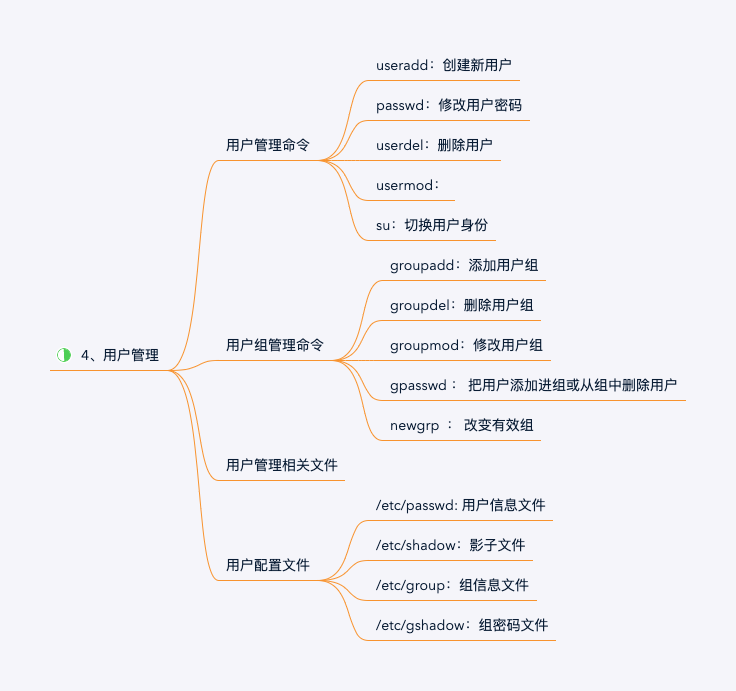

用户和用户组管理




用户和用户组管理，是添加用户和用户组、更改密码和设定权限等操作。在此，需要解决以下问题：
- 在Linux下，如何创建和修改用户和用户组信息？
- 在Linux下，如何查看用户、用户组信息？
- 在Linux下，哪些文件管理用户、用户组信息？

## 一、用户管理命令 ##

### 1. useradd - 创建新用户 ###

**格式**

```shell
[root @ ~]# useradd [选项] 用户名
```
**选项&参数**

- `-c`	添加备注文字
- `-d`	新用户每次登陆时所使用的家目录
- `-e`	用户终止日期，日期的格式为YYYY-MM-DD
- `-f`	用户过期几日后永久停权。当值为0时用户立即被停权，而值为-1时则关闭此功能，预设值为-1
- `-g`	指定用户对应的用户组
- `-G`	定义此用户为多个不同组的成员
- `-m`	用户目录不存在时则自动创建
- `-M`	不建立用户家目录，优先于/etc/login.defs文件设定
- `-n`	取消建立以用户名称为名的群组
- `-r`	建立系统帐号
- `-u`	指定用户id

**说明**
1. Linux创建新用户有2种形式：默认创建 和 手工创建

- 默认创建 : 直接运行 useradd + 用户名
- 手工创建 : 在 useradd 带上选项 自行设定 UID、初始组、home目录、附加组、用户说明和用户登录shell

2. 默认创建

在默认创建过程中，其实是依据默认模版完成用户基本信息创建。这个模版/etc/default/useradd.默认创建整个过程：
- 在/etc/passwd中添加新用户
- 在/etc/shadow中添加新用户密码信息，此时为!!即密码暂不可用
- 在/etc/group中添加信用户信息，默认组为100。
- 创建用户home目录及邮箱。分别在/home目录、/var/spool/mail查看

**示例**

```shell
#查看默认安装的模版文件
[root@centos7 ~]# vim /etc/default/useradd

#创建新用户
[root@centos7 ~]# useradd paulvim
    
#在/etc/passwd中查看创建新用户信息
paulvim:x:1000:1001::/home/paulvim:/bin/bash
```

### 2. passwd - 修改用户密码 ###

**格式**

```shell
[root @ ~]# passwd [选项] 用户名
```

**选项&参数**

- `-d`	删除密码
- `-l`	锁定用户密码，无法被用户自行修改
- `-u`	解开已锁定用户密码，允许用户自行修改
- `-e`	密码立即过期，下次登陆强制修改密码
- `-k`	保留即将过期的用户在期满后能仍能使用
- `-S`	查询密码状态

**说明**

普通用户仅可以修改自己密码；root用户可以修改普通用户密码

### 3. userdel - 删除用户 ###

**格式**

```shell
[root @ ~]# userdel [参数] [用户名]
```

**选项&参数**

- `-f`	强制删除用户账号
- `-r`	删除用户主目录及其中的任何文件

### 4. su - 切换用户身份 ###

**格式**

```shell
[root @ ~]# su [选项] [用户名]
```

**选项&参数**
- `-l` 或 `--login`	改变身份时，也同时变更工作目录，以及HOME,SHELL,USER,logname,此外，也会变更PATH变量

**说明**

- 1、在普通用户切换到root用户时，需要密码；

- 2、在切换过程中，若不带参数 -l 则改变身份同时不改变用户环境变量。

**示例**

```shell
[root @~]# su paul
#由root用户切换到Paul用户，此时无需密码，使用的是root的用户环境变量。
```

### 5. usermod - 修改用户信息 ###

**格式**

```shell
[root @ ~]# usermod [参数] 
```

**选项&参数**

- `-d` <登入目录>	 修改用户登入时的目录. 必须写绝对路径。
- `-g` <群组>		修改用户所属的群组。修改/etc/passwd文件信息。
- `-G` <群组>		修改用户所属的附加群组
- `-l` <账号名称>	 修改用户账号名称

**说明**

- usermod命令用于修改用户账号
- usermod可用来修改用户账号的各项设定，修改系统账号文件来反映通过命令行指定的变化

**示例**

```shell
[paul@centos7 ~]$ more /etc/passwd | grep paulvim
pvim:x:1000:1001::/home/paulvim:/bin/bash

[paul@centos7 ~]$ sudo usermod -l paulvim pvim

[paul@centos7 ~]$ more /etc/passwd | grep paulvim
paulvim:x:1000:1001::/home/paulvim:/bin/bash

```

## 二、用户组管理命令 ##

### 1. groupadd - 添加用户组 ###

**格式**

```shell
[root @ ~]# groupadd [参数&选项] [组名]
```

**选项&参数**

- `-g` GID:指定组ID

**说明**

- 创建一个新的工作组，信息将写入到/etc/group系统文件中。
- 1-499系统预留的编号,预留给安装的软件和服务的;用户手动创建的用户组从500开始。

**示例**

```shell
[root @ ~]# groupadd -g 888 "mysql"
#新建mysql组，其组号为888
```

### 2. groupdel - 删除用户组 ###

**格式**

```shell
[root @ ~]# groupdel [参数] [组名]
```
**选项&参数**

- `-R`	在chroot_dir目录中应用更改并使用chroot_dir目录中的配置文件

**说明**

- 命令用来删除用户组;
- 本命令将对/etc/group 和 /etc/gshadow进行修改。
- 若用户组中，仍包含用户则需要先删除用户再执行该命令。

### 3. groupmod - 修改用户组 ###

**格式**

```shell
[root @ ~]# groupmod [参数&选项] [组名]
```

**选项&参数**

- `-g` GID: 修改组ID
- `-n` 新组名，修改组名

**说明**

- 命令用来修改已有组名信息（GID、组名等）
- 会对/etc/group中系统数据进行相应修改。

**示例**

```shell
#修改paulvim名称为pvim。注意GID是没有变化。
[paul@centos7 ~]$ grep paulvim /etc/group
paulvim:x:1001:

[paul@centos7 ~]$ sudo groupmod -n pvim paulvim

[paul@centos7 ~]$ grep paulvim /etc/group
[paul@centos7 ~]$ grep pvim /etc/group
pvim:x:1001:

```

### 4. gpasswd - 把用户添加进组或从组中删除用户 ###

**格式**
```shell
[root @ ~]# gpasswd [参数&选项] [组名]
```

**选项&参数**

- `-a` 用户名：把用户加入组
- `-d` 用户名：把用户从组删除

**说明**

- gpasswd命令将对/etc/group 和 /etc/gshadow进行修改；
- gpasswd命令用来修改群组命令、添加用户到组、从组删除用户等
- usermod操作对象是用户，把用户名作为参数放在最后；gpasswd命令操作对象是组，把组名放在最后。

**示例**
```shell
paul@centos7 ~]$ more /etc/group | grep paul
root:x:0:paul
paul:x:1000:

#将用户paulvim加入到paul组
[paul@centos7 ~]$ sudo gpasswd -a paulvim paul
Adding user paulvim to group paul

#查看paul组信息
[paul@centos7 ~]$ more /etc/group | grep paul
root:x:0:paul
paul:x:1000:paulvim
```

### 5. newgrp - 改变有效组 ###

**格式**
```shell
[root @ ~]# newgrp [组名]
```

**说明**

- 单一用户要同时隶属多个群组，需利用交替用户的设置。若不指定群组名称，则newgrp指令会登入该用户名称的预设群组。
- 通过newgrp切换用户组后，该用户下新建的文件后，所属群组将为切换后的”用户组“。例如：paul的初始组为paul，后加入root组。执行 newgrp root后，此时paul的用户组为root。

**示例**

```shell
#paul的初始组为paul，后加入root组。执行 newgrp root后，此时paul的用户组为root。
[paul@centos7 ~]$ newgrp root
[paul@centos7 ~]$ vim test.vi
[paul@centos7 ~]$ ll
-rw-r--r--.  1 paul root         5 Apr 20 12:44 test.vi

```

## 三、用户管理相关文件 ##

1．用户的家目录
- 普通用户的家目录位于/home/下，目录名和用户名相同

2．用户邮箱目录

3．用户模板目录
- 模板目录就是/etc/skel/目录

## 四、用户配置文件 ##

### 1. 用户信息文件:/etc/passwd ###

“:”作为分隔符，划分为7个字段
- 1、用户名：
	Linux系统是通过用户ID（UID）来区分不同用户、分配用户权限的
	
- 2、密码标识:
	“x”代表的是密码标志，而不是真正的密码，真正的密码是保存在/etc/shadow文件中的
	
- 3、UID
	- 0：超级用户UID
	- 1～499：系统用户（伪用户）UID用户是不能登录系统的，而是用来运行系统或服务的
	- 500～65535：普通用户UID
- 4、GID
	- 用户的组ID（GID），也就是这个用户的初始组的标志号
	- 所谓初始组，指用户一登录就立刻拥有这个用户组的相关权限
	- 所谓附加组，指用户可以加入多个其他的用户组，并拥有这些组的权限
- 5、用户说明
- 6、家目录
- 7、登录之后的Shell
	- /bin/bash就代表这个用户拥有权限范围内的所有权限

### 2. 影子文件:/etc/shadow ###

Linux系统把真正的加密密码串放置在影子文件/etc/shadow中，而影子文件的权限是000

使用“:”作为分隔符，划分为9个字段
- 1．用户名称
- 2．密码

	- 目前Linux的密码采用的是SHA512散列加密算法，而原来采用的是MD5或DES加密算法
	- 所有伪用户的密码都是“! !”或“*”，代表没有密码是不能登录的
	- 可以在密码前人为地加入“!”或“*”改变加密值让密码暂时失效，使这个用户无法登录，达到暂时禁止用户登录的效果
- 3．密码最后一次修改日期
	- Linux更加习惯使用时间戳代表时间
	- 以1970年1月1日作为标准时间，每过去一天时间戳加1
- 4．密码的两次修改间隔时间（和第三个字段相比）
- 5．密码的有效期（和第三个字段相比）
- 6．密码修改到期前的警告天数（和第五个字段相比）
- 7．密码过期后的宽限天数（和第五个字段相比）
- 8．账号失效时间
- 9．保留

### 3. 组信息文件:/etc/group ###

用“:”作为分隔符，划分为4个字段
- 1．组名
- 2．组密码标志
	- 用户组密码主要是用来指定组管理员的
- 3．组ID（GID）
- 4．组中的用户

### 4.组密码文件:/etc/gshadow ###

这个文件就是保存组密码的文件

“:”作为分隔符，把文件划分为4个字段:

- 1. 组名 第一个字段是这个用户的组名
- 2. 组密码 实际加密的组密码
- 3. 组管理员用户名 
- 4. 组中的附加用户