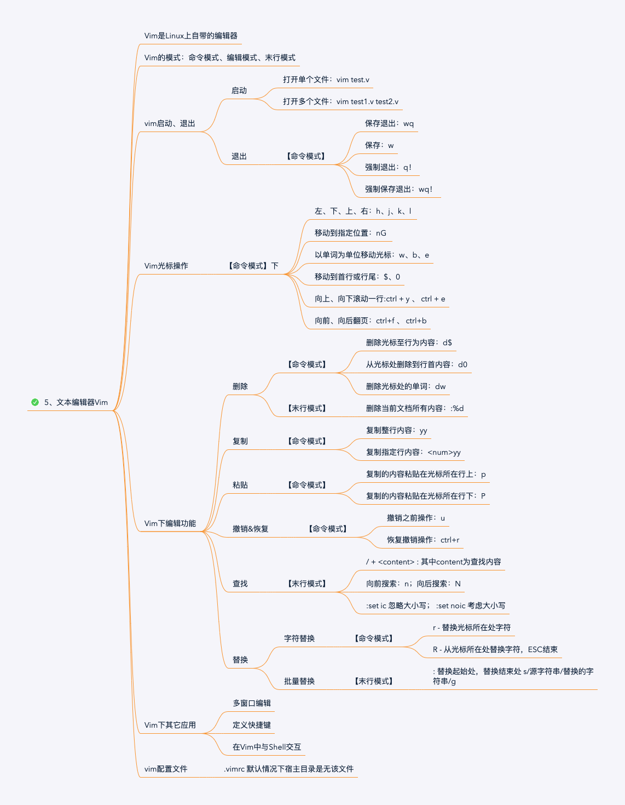

Vim编辑器

主要记录总结在学习Vim过程中的知识点：

- 1、 vim是什么？
- 2、 为什么使用vim？
- 3、 vim常用功能
- 4、 vim一些高级功能


# Vim的介绍

***介绍Vim是什么？为什么使用Vim***

[Vim](www.vim.org) 是一个文本界面的编辑工具，具有高配置性，使用简单功能强大；Vim是所有***Linux发行版本默认的文本编辑器***。

Vi是Vim的早期版本，Vim（Vi improved）是Vi的增强版，主要增加了一些多窗口编辑、查找功能。

可通过[Vimhelp](https://vimhelp.org/) 学习Vim的基本功能、查看Vim功能设置。

# Vim的基本应用

***介绍Vim的基本功能用法：启用和退出Vim、编辑功能（编辑、保存、修改、删除、替换、查找等）、基本参数设定***

## 1. Vim的工作模式

Vim有三个工作模式：***命令模式***、***编辑模式***和***末行模式***。三个模式之间相互切换：

- 1）当启用Vim进入的是【命令模式】；

- 2）按英文字母 “i” 或 “I” 则进入【编辑模式】（Insert模式）；在最下方出现“--INSERT--”提示；
  在【编辑模式】下按“Esc”则回到【命令模式】。

- 3）在【编辑模式】下，按**英文的“:”**则加入【末行模式】，在最下方可以输入相关命令。例如:输入 q！ - 则不保存当前文档并退出。

## 2. Vim的启动和退出

- A. 通过Vi / Vim 命令来启用Vim:

```shell
##打开一个文件
$ vim /workspace/test.vi
```
若需要打开多个文件，情况如下：

```shell
##打开多个wenjian
$ vim /workspace/test.vi /workspace/helloworld.c
```
在【命令模式】下，输入：ls 查看所打开的文件；

在【命令模式】下，输入：b <num>   "<num>"则是第几个文件。

- B. Vi / Vim 保存退出

在【命令模式】通过输入“：”进入【末行模式】：

> a、`wq` 则保存退出；
>
> b、`q!`则不保存强制退出；`wq!` 保存强制退出；
>
> c、'w' 则保存不退出；

有此可以看出，保存退出是由'w'、'q'、'!'组成：

> 'w' --- 保存不退出
>
> 'q' --- 不保存退出
>
> '!' --- 强制性操作

   ```Shell
   #将文件helloworld.c保存到指定目录，但不退出。
   :w /workspace/helloworld.c
   ```

   在【命令模式】下，输入 ZZ 或 按两次 “shift + Z”也可以不保存退出。

## 3. Vim的光标操作

- 在【命令模式】下，以字符为单位移动光标：
      1）使用“h、j、k、l”（即左、下、上、右）可以控制光标以字符为单位移动；在字母前输入‘数字’则表示移动的距离。
      2）通过方向键”上、下、左、右“更为方便控制光标以字符为单位移动。而在【编辑模式】下方向键也便于控制光标移动。

- 在【命令模式】下，移动到指定行处：
   “nG”（n为数字，G为大写）或“:n”（在编辑模式中输入数字）命令将光标快速地定位到指定行的行首；输入英文字母G将光标移到文件的末尾，gg将光标移到文件的开始。

- 在【命令模式】下，常用的光标移动方式：

  - **A、以单词为单位移动光标**：

    w - 移动光标到下一个单词的单词首

    b - 移动光标到上一个单词的单词首

    e - 移动光标到下一个单词单词尾

  - **B、移动到行首或行尾：**

    $  - 移动光标到行尾

    0 或 ^  - 移动光标到行首

  - **C、向上、向下滚动一行：**

    Ctrl + y 向上滚动一行文本操作；

    Ctrl + e 向下滚动一行文本操作；

  - **向前、向后翻页：**

    可以通过Ctrl+f和Ctrl+b来实现向前和向后翻页的操作

## 4.Vim文本复制、粘贴、删除操作

***1）删除***

- 在【命令模式】下，用'dd'删除当前行；在' <num> dd'则可以删除指定行（例如：3dd，则删除第3行）

​			'd$' 则删除从光标处到行尾内容；

​			'd0' 从光标处删除到行首的内容；

​			'dw' 删除光标处的单词

- 在【末行模式】下输入':%d'，删除当前文档所有内容。

***2）复制和粘贴***

- 在【命令模式】下，输入'yy'复制整行内容；在'<num>yy'则复制指定行内容（例如：3yy，复制第三行内容）

​		输入'p'则表示将复制的内容粘贴在光标所在行上；'P' 则表示将复制的内容粘贴在光标所在行下。

​		***区域复制***通过Ctrl+V 、 y、 p组合完成。

- 在【命令模式】下，光标移动需要复制的字符处，按 'ctrl + v'（此时最下方将显示‘VISUAL BLOCK’） ，再移动光标至结束；按下'y',移动光标至需要粘贴的位置，按'p'。

***3）撤销和恢复***

- 在【命令模式】下，输入'u'表示撤销之前的操作；'ctrl+r'则表示恢复撤销的操作。

## 5. Vim查找和替换操作

***1）查找***

在【末行模式】下，输入**'/ + <content>'** ：

​		<content> 输入需要查找的内容（或正则表达式）。在查找结果中，按字母'n'则表示向前搜索，'N'表示向后搜索。

​		如果想**忽略大小写**，在【末行模式】输入**:set ic** ；而 **:set noic** 则表示考虑大小写。

***2）替换***

- 在【命令模式】下：
      r - 替换光标所在处的字符
      R - 从光标所在处替换字符，按Esc结束

***3） 批量替换***

- 在【末行模式】下，输入：
  : 替换起始处，替换结束处 s/源字符串/替换的字符串/g

***4）替换范围内的字符串***

  :% s/源字符串/替换的字符串/g

  \- 替换整篇文档的字符串

如果不带'g'，则只替换每行第一个找到的字符串。

## 6.Vim的其它应用

**1）Vim配置文件**

如果.vimrc文件存在，就先读取其中对Vim的设置；否则就采取默认配置。

在默认情况下，用户宿主目录中是没有此文件的，需要在当前用户的宿主目录中手工建立，如"vim ~ /.vimrc"，  “~”代表宿主目录，root的宿主目录为/root/，普通用户的宿主目录存放在/home/目录下。

**2）多窗口编辑**

- 末行模式中输入sp或vs来实现对窗口的水平或垂直拆分
- 切换到另一个文件窗口，可以按**“Ctrl+WW”**快捷键。
- 如果想将一个文件的内容全部复制到另一个文件中，则可以输入命令“:r被复制的文件名”，即可将导入文件的全部内容复制到当前光标所在行下面。

**3）定义快捷键**
    :map 快捷键 执行命令 - 定义快捷键
    :unmap 快捷键       - 释放快捷键

**4）在Vim中与Shell交互**
    在【编辑模式】下用“！”命令访问Linux的shell进行操作。例如：:! pwd  - 查看当前文档路径

​	如果需要将Shell的执行结果，放入文档。在【编辑模式】下使用'r'。例如：:r ! date

# Vim小结

1、Vim是Linux上自带的编辑器；

2、Vim的模式：命令模式、编辑模式、末行模式

3、Vim启动和退出

4、Vim下编辑功能：
    a、插入
    b、复制、粘贴
    c、查找、替换
    d、撤销

5、Vim下其它应用：
    a、多窗口编辑
    b、定义快捷键
    c、在Vim中与Shell交互



6、[Vim常用命令速查](https://github.com/skywind3000/awesome-cheatsheets) 

7、参考：

[Linux环境下vi/vim编辑器常用命令](https://www.cnblogs.com/jacktian-it/p/9876519.html)