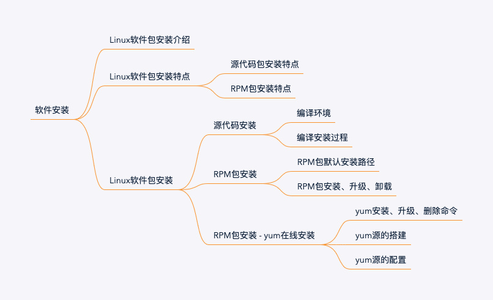

# 常用软件安装-Python安装

常用软件安装，将在CentOS7环境逐步完成，anaconda、python（配置jupyterlab）、redis、mysql、nginx、mongodb安装，是之前各个章节知识的实践。主要目标：

- 1、熟悉Linux的命令；
- 2、熟悉Linux下目录结构；
- 3、 安装思维导图



## 1、前期准备

- 0）通过SSH连接远程CentOS（ssh）

- 1）查看Linux当前是否有Python及所含版本（whereis\which）

```shell
[paul@centos7 ~]$ which python
/usr/bin/python

[paul@centos7 ~]$ python --version
Python 2.7.5
```

- 2）查看Linux当前版本（uname）

```shell 
[paul@centos7 ~]$ uname -a
Linux centos7 3.10.0-693.el7.x86_64 #1 SMP Tue Aug 22 21:09:27 UTC 2017 x86_64 x86_64 x86_64 GNU/Linux
```

- 3）下载相应的Python程序（yum、wget、tar）

```shell
#下载Python安装包
[paul@centos7 ~]$ wget https://www.python.org/ftp/python/3.10.4/Python-3.10.4.tgz

#解压Python安装包
[paul@centos7 ~]$ tar -zxvf Python-3.10.4.tgz
[paul@centos7 ~]$ cd Python-3.10.4
```

## 2、安装

### 1) 安装Python

- A. 编译安装python（make、su）

```shell

#切换root身份
[paul@centos7 ~]$ su root

[root@centos7 Python-3.10.4]# yum install libffi-devel zlib-devel bzip2-devel openssl-devel ncurses-devel sqlite-devel readline-devel tk-devel gcc* make -y --skip-broken

[root@centos7 Python-3.10.4]#mkdir  /usr/local/python310

#编译安装Python

##1. 生成makefile。  ./configure 是用来检测你的安装平台的目标特征的。比如它会检测你是不是有CC或GCC，并不是需要CC或GCC，它是个shell脚本.
[root@centos7 Python-3.10.4]# ./configure --prefix=/usr/local/python310 --with-openssl=/usr/local/openssl

##2. 编译。 make 是用来编译的，它从Makefile中读取指令，然后编译。
[root@centos7 Python-3.10.4]# make

##3. 安装。  make install是用来安装的，它也从Makefile中读取指令，安装到指定的位置
[root@centos7 Python-3.10.4]# make install

```

- B. 查看安装路径（whereis）

```shell 
[root@centos7 Python-3.10.4]# whereis python
python: /usr/bin/python /usr/bin/python2.7 /usr/lib/python2.7 /usr/lib64/python2.7 /etc/python /usr/local/bin/python3.10 /usr/local/bin/python3.10-config /usr/local/lib/python3.10 /usr/include/python2.7 /usr/share/man/man1/python.1.gz
```

- C. 设置软链接（ln）

```shell

[root@centos7 bin]# whereis python
python: /usr/bin/python /usr/bin/python2.7 /usr/lib/python2.7 /usr/lib64/python2.7 /etc/python /usr/local/bin/python3.10 /usr/local/bin/python3.10-config /usr/local/lib/python3.10 /usr/include/python2.7 /usr/share/man/man1/python.1.gz

[root@centos7 bin]# pwd
/usr/bin

[root@centos7 bin]# ln -s /usr/local/python310/bin/python3 /usr/bin/python3
[root@centos7 bin]# ln -s /usr/local/python310/bin/pip3 /usr/bin/pip3

[root@centos7 bin]# ls -la | grep python
lrwxrwxrwx.  1 root root         7 Apr  3  2018 python -> python2
lrwxrwxrwx.  1 root root         9 Apr  3  2018 python2 -> python2.7
-rwxr-xr-x.  1 root root      7136 Aug  4  2017 python2.7
lrwxrwxrwx.  1 root root        25 Apr  6 14:56 python310 -> /usr/local/bin/python3.10
```

- D. 更改pip源地址（清华、阿里等）（vim）

​修改 ~/.pip/pip.conf

```shell
[global]
index-url = https://pypi.tuna.tsinghua.edu.cn/simple
[install]
trusted-host=mirrors.aliyun.com
```

- E. 验证Python、pip

```shell
[root@centos7 paul]# python3
Python 3.10.4 (main, Apr  7 2022, 10:42:34) [GCC 4.8.5 20150623 (Red Hat 4.8.5-44)] on linux
Type "help", "copyright", "credits" or "license" for more information.

[root@centos7 paul]# pip3 show pip
Name: pip
Version: 22.0.4
Summary: The PyPA recommended tool for installing Python packages.
Home-page: https://pip.pypa.io/
Author: The pip developers
Author-email: distutils-sig@python.org
License: MIT
Location: /usr/local/python310/lib/python3.10/site-packages
Requires:
Required-by:

[root@centos7 paul]# pip3 --version
pip 22.0.4 from /usr/local/python310/lib/python3.10/site-packages/pip (python 3.10)
```

### 2）安装JuypterLab

- A. 安装Jupyterlab

```shell
[paul@centos7 ~]$pip3 install jupyterlab
```

- B. 配置Jupiter远程访问
- + 生成配置文件

```shell
[paul@centos7 ~]$ jupyter lab --generate-config
Writing default config to: /home/paul/.jupyter/jupyter_lab_config.py
```

- + 生成访问密码

```shell
[paul@centos7 ~]$ python3
Python 3.10.4 (main, Apr  7 2022, 10:42:34) [GCC 4.8.5 20150623 (Red Hat 4.8.5-44)] on linux 
Type "help", "copyright", "credits" or "license" for more information. 
>>> from jupyter_server.auth import passwd

>>> passwd()                                                                      Enter password:                                                     Verify password:
>>> 'argon2:$argon2id$v=19$m=10240,t=10,p=8$zhPe5EBrTerUNWaIlIFyqg$5TEqKGxX0ONY232oVquNm+h3z3D1ps4pMwnI1ibc8yA'
>>> exit()
```

- + 修改配置文件

```shell
[paul@centos7 ~]$ vim .jupyter/jupyter_notebook_config.py
```

在文件最后添加一下内容：

```shell

c.ServerApp.password = u'argon2:$argon2id$v=19$m=10240,t=10,p=8$zhPe5EBrTerUNWaIlIFyqg$5TEqKGxX0ONY2     32oVquNm+h3z3D1ps4pMwnI1ibc8yA'
c.ServerApp.open_browser = False
c.ServerApp.port = 8888
c.ServerApp.allow_root = False
c.ServerApp.notebook_dir = "/home/paul"

```

- + 检查网络及防火墙

```shell
[paul@centos7 ~]$ netstat -ntlp

[root@centos7 paul]# firewall-cmd --query-port=8888/tcp
no

[root@centos7 paul]# firewall-cmd --permanent --add-port=8888/tcp
success
[root@centos7 paul]# firewall-cmd --reload
success

```

- + 后台启动Jupyterlab

```shell
[paul@centos7 ~]$ nohup jupyter lab &
[1] 8492
```

- + 安装Jupyter插件

```shell

pip3 install jupyterlab-language-pack-zh-CN # 安装中文界面

jupyter labextension install @jupyterlab/toc

```

## 3、验证

- 查看python版本

```shell
[paul@centos7 ~]$ python3
```

- 回顾使用的Linux命令（history）

```shell
[paul@centos7 ~]$ history
```

## 4、总结

通过本次安装练习，完成巩固前期指令的学习。对Linux软件安装过程、目录结构有实践性了解。

0、安装思路：在Linux下源码安装软件，主要流程：
- a、下载&解压：wget、tar
- b、./configure (可进入./configure --help 查看帮助)
- c、编译：make
- d、安装：make install

1、熟悉Linux的命令：
安装过程常使用到的命令：ls、cd、mkdir、wget、make等。

2、熟悉Linux下目录结构：
主要使用目录/usr/local、/usr/bin等。

## 5、参考

1、[Linux 命令详解（三）./configure、make、make install 命令](https://www.cnblogs.com/tinywan/p/7230039.html)
