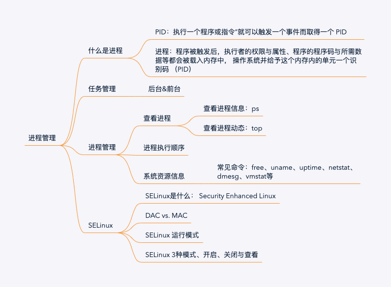
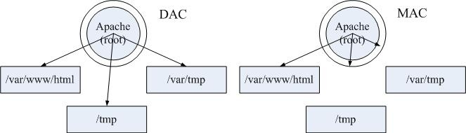
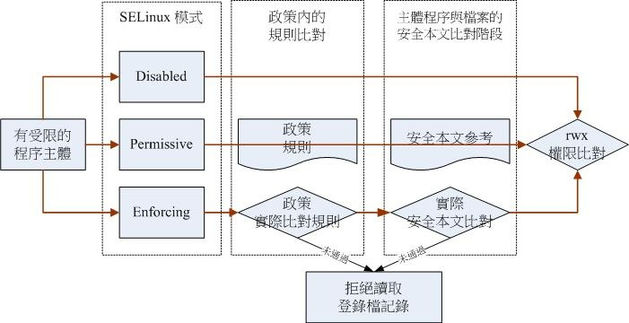

# 1. 什么是进程

在 Linux 的程序调用通常称为 fork-and-exec 的流程。
常驻内存的程序，被称为“服务daemon”。系统或网络服务，常驻在内存的进程。

# 2. 任务管理

任务管理（Job control）是在bash环境下，执行多个任务的操作管理。

1）程序放入后台中“执行”的 &
2）将“目前”的进程“暂停”并放入后台：[ctrl]-z
3）观察目前的”后台“工作状态： jobs
```shell
[root@ ~]# jobs [-lrs]
选项与参数：
-l  ：除了列出 job number 与指令串之外，同时列出 PID 的号码；
-r  ：仅列出正在后台 run 的工作；
-s  ：仅列出正在后台当中暂停 （stop） 的工作。

[root@ ~]# jobs
[1]  - suspended  find / -print
[2]  + suspended  ~/.local/bin/vim ~/.bashrc
```
> “+/-”说明：
> \+ 代表最近放入后台的任务；
> \- 代表最近最后第2个放入后台的任务；
> 3个之后的任务不再显示 “+/-”符号。

4）将“后台”工作拿到“前台”来处理：fg
```shell
[root@ ~]# fg %jobnumber
选项与参数：
%jobnumber ：jobnumber 为任务号码（数字）。注意，那个 % 是可有可无的！
```
5）让工作在"后台“下的状态变成运行中： bg
```shell
[root@ ~]# bg %jobnumber
选项与参数：
%jobnumber ：jobnumber 为任务号码（数字）。
```
6）管理”后台“当中的工作： kill
```shell
[root@ ~]# kill -signal %jobnumber
选项与参数：
-l  ：这个是 L 的小写，列出目前 kill 能够使用的信号 （signal） 有哪些？
signal ：代表给予后面接的那个工作什么样的指示啰！用 man 7 signal 可知：
  -1 ：重新读取一次参数的配置文件 （类似 reload）；
  -2 ：代表与由键盘输入 [ctrl]-c 同样的动作；
  -9 ：立刻强制删除一个工作；
  -15：以正常的程序方式终止一项工作。与 -9 是不一样的。
```

7）练习

```shell

```

# 3. 进程管理

## 1. 查看进程

### 静态进程状态：ps
```shell
## 查看系统所有进程
[root@ ~]# ps aux
## 查看所有系统的进程
[root@ ~]# ps -lA
## 查看进程并显示进程树
[root@ ~]# ps axjf
```

```shell
[root@ ~]# ps aux
USER       PID %CPU %MEM    VSZ   RSS TTY      STAT START   TIME COMMAND
root         1  0.0  0.3 128124  6724 ?        Ss   6月22   0:13 /usr/lib/systemd/systemd --switched-r
root         2  0.0  0.0      0     0 ?        S    6月22   0:00 [kthreadd]
root         4  0.0  0.0      0     0 ?        S<   6月22   0:00 [kworker/0:0H]
root         6  0.0  0.0      0     0 ?        S    6月22   0:06 [ksoftirqd/0]
root         7  0.0  0.0      0     0 ?        S    6月22   0:00 [migration/0]
......
```

USER：该进程所属账号；
PID ：该进程的ID；
%CPU：该进程使用掉的 CPU 资源百分比；
%MEM：该进程所占用的实体内存百分比；
VSZ ：该进程使用掉的虚拟内存量 （KBytes）
RSS ：该进程占用的固定的内存量 （KBytes）
TTY ：该进程是在那个终端机上面运行，若与终端机无关则显示 ?，另外， tty1-tty6 是本机上面的登陆者程序，若为 pts/0 等等的，则表示为由网络连接进主机的程序。
STAT：该程序目前的状态，状态显示与 ps -l 的 S 旗标相同 （R/S/T/Z）
START：该进程被触发启动的时间；
TIME ：该进程实际使用 CPU 运行的时间。
COMMAND：该程序的实际指令为何


```shell
[root@ ~]# ps -l
F S   UID   PID  PPID  C PRI  NI ADDR SZ WCHAN  TTY          TIME CMD
4 S     0 15185 15180  0  80   0 - 36801 sigsus pts/0    00:00:00 zsh
0 R     0 15260 15185  0  80   0 - 38332 -      pts/0    00:00:00 ps
```

- F：代表这个进程标识（process flags），说明这个进程的权限。若为4标识此进程的权限；若为1则表示为子进程，仅进行复制而没实际执行。
- S：代表此进程的状态（STAT）：
    R（Runing）：表示进程运行中；
    S（Sleep）：表示进程处于睡眠状态（idle），可被唤醒（signal）
    D：不可被唤醒的睡眠状态；
    T：停止状态（stop）
    Z（Zombie）：僵尸状态，表示该进程已经终止但无法从内存移除。
- UID/PID/PPID：该进程的UID、PID以及父进程PID；
- C：代表CPU使用率，一般为百分比
- PRI/NI（Priority/Nice）：代表该进程被CPU所执行的优先顺序，数值越小表示该进程越快被CPU执行。
- ADDR/SZ/WCHAN：与内存有关系。
    ADDR是kernel function，指该进程在内存的哪个部分。如果是running，用“-”表示。
    SZ 表示该进程所消耗的内存
    WCHAN 表示进程是否运行中，“-”表示运行中
- TTY：登陆者的终端机位置
- TIME：该进程使用掉CPU的时间
- CMD：产生该进程的触发程序

```shell
[root@ ~]# ps axjf
 PPID   PID  PGID   SID TTY      TPGID STAT   UID   TIME COMMAND
    0     2     0     0 ?           -1 S        0   0:00 [kthreadd]
    2     4     0     0 ?           -1 S<       0   0:00  \_ [kworker/0:0H]
    2     6     0     0 ?           -1 S        0   0:06  \_ [ksoftirqd/0]
    2     7     0     0 ?           -1 S        0   0:00  \_ [migration/0]
    2     8     0     0 ?           -1 S        0   0:00  \_ [rcu_bh]
````

### 动态进程变化: top

```shell
[root@ ~]# top [-d 数字] | top [-bnp]
选项与参数：
\-d  ：后面可以接秒数，就是整个程序画面更新的秒数。默认是 5 秒；
\-b  ：以批次的方式执行 top ，还有更多的参数可以使用喔！
    通常会搭配数据流重导向来将批次的结果输出成为文件。
\-n  ：与 -b 搭配，意义是，需要进行几次 top 的输出结果。
\-p  ：指定某些个 PID 来进行观察监测而已。
在 top 执行过程当中可以使用的按键指令：
    ? ：显示在 top 当中可以输入的按键指令；
    P ：以 CPU 的使用资源排序显示；
    M ：以 Memory 的使用资源排序显示；
	N ：以 PID 来排序喔！
	T ：由该 Process 使用的 CPU 时间累积 （TIME+） 排序。
	k ：给予某个 PID 一个讯号  （signal）
	r ：给予某个 PID 重新制订一个 nice 值。
	q ：离开 top 软件的按键。


# 每2秒钟更新一次 top：
[root@ ~]# top -d 2

top - 14:33:40 up 8 days, 22:28,  1 user,  load average: 0.00, 0.01, 0.05
Tasks: 109 total,   1 running, 108 sleeping,   0 stopped,   0 zombie
%Cpu(s):   0.0/0.5     0[                                                     ]
KiB Mem :  1881980 total,   829400 free,   493008 used,   559572 buff/cache
KiB Swap:  2097148 total,  2097148 free,        0 used.  1192748 avail Mem

  PID USER      PR  NI    VIRT    RES    SHR S %CPU %MEM     TIME+ COMMAND
16566 root      20   0  162116   2268   1568 R  1.0  0.1   0:00.07 top
    6 root      20   0       0      0      0 S  0.5  0.0   0:08.97 ksoftirqd/0
16479 root      20   0  158988   5720   4372 S  0.5  0.3   0:00.76 sshd
    1 root      20   0  128124   6724   4184 S  0.0  0.4   0:14.52 systemd
    2 root      20   0       0      0      0 S  0.0  0.0   0:00.13 kthreadd
    4 root       0 -20       0      0      0 S  0.0  0.0   0:00.00 kworker/0:0

```

```shell
[root@ ~]# pstree [-A|U] [-up]
选项与参数：
-A  ：各进程树之间的连接以 ASCII 字符来连接；
-U  ：各进程树之间的连接以万国码的字符来连接。在某些终端接口下可能会有错误；
-p  ：并同时列出每个进程的 PID；
-u  ：并同时列出每个进程的所属帐号名称。

[root@ ~]# pstree -Aup
systemd(1)-+-NetworkManager(690)-+-dhclient(8840)
           |                     |-{NetworkManager}(703)
           |                     `-{NetworkManager}(706)
           |-agetty(8906)
           |-auditd(640)---{auditd}(641)
           |-crond(996)
           |-dbus-daemon(667,dbus)---{dbus-daemon}(679)
           |-firewalld(688)---{firewalld}(811)
           |-gssproxy(672)-+-{gssproxy}(674)
           |               |-{gssproxy}(675)
......

```

## 2. 进程执行顺序

进程有并发、单进程，在执行过程需要占用 CPU，故进程的执行顺序 与 CPU的调度有关系。 CPU调度与操作系统具有相关性。

### Priority 与 Nice 值

PRI 是核心动态调整的，使用者无权直接修改PRI值。如果需要调整进程优先顺序，可通过Nice值。一般情况PRI值 与 NI 值的关系如下：
PRI（new） = PRI（old） + NI

- nice值调整范围-20 ～ 19；
- root 可以调整其他用户进程的Nice值，范围：-20～19；
- 一般使用者调整自己Nice值，范围：0～19；

### 赋值 Nice 、重新赋值（renice）

```shell
[root@ ~]# nice [-n 数字] command
选项与参数：
-n  ：后面接一个数值，数值的范围 -20 ~ 19。

[root@ ~]# renice [number] PID
```

## 3. 查看系统资源信息

free：查看内存使用情况

uname：查看系统与核心信息

uptime：查看系统启动时间

netstat：查看网络信息

dmesg：查看内核产生的信息

vmstat：检测系统的资源变化

# 4. SELinux

## 1. SELinux 是什么

Security Enhanced Linux (SELinux)，它是由美国国家安全局（NSA）贡献的，它为 Linux 内核子系统引入了一个健壮的强制控制访问Mandatory Access Control架构。用以提供访问控制安全策略的机制。

SELinux 主要是红帽 Red Hat Linux以及它的衍生发行版上的一个工具。类似地，Ubuntu 和 SUSE（以及它们的衍生发行版）使用的是 AppArmor。SELinux 和 AppArmor 有显著的不同。

## 2. DAC 和 MAC

Linux 上传统的访问控制标准是自主访问控制 Discretionary Access Control（DAC）。在这种形式下，一个软件或守护进程以 User ID（UID）或 Set owner User ID（SUID）的身份运行，并且拥有该用户的目标（文件、套接字、以及其它进程）权限。这使得恶意代码很容易运行在特定权限之下，从而取得访问关键的子系统的权限。

强制访问控制 Mandatory Access Control（MAC）基于保密性和完整性强制信息的隔离以限制破坏。该限制单元独立于传统的 Linux 安全机制运作，并且没有超级用户的概念。



## 3. SELinux 运行模式

主体 （Subject）: 主体为进程
目标  (Object)：主体进程能否读写“目标资源”一般指文件系统。
策略  (Policy）：由一系列规则组成，在某服务下开放哪些资源。在CentOS下有三大主要策略：
    - targeted：针对网络服务限制较多，针对本机限制较少，是默认的策略
    - minimum：在targeted基础上进行了修订，主要针对选择的进程来保护；
    - mis：完整的SELinux限制，限制方面较为严格。



当一个主体Subject（如一个程序）尝试访问一个目标Object（如一个文件），SELinux 安全服务器SELinux Security Server（在内核中）从策略数据库Policy Database中运行一个检查。基于当前的模式mode，如果 SELinux 安全服务器授予权限，该主体就能够访问该目标。如果 SELinux 安全服务器拒绝了权限，就会在 /var/log/messages 中记录一条拒绝信息。

## 4. SELinux 的3种模式、启动、关闭与查看

### .1 SELinux 三种模式

Enforcing强制 — SELinux 策略强制执行，基于 SELinux 策略规则授予或拒绝主体对目标的访问

Permissive宽容 — SELinux 策略不强制执行，不实际拒绝访问，但会有拒绝信息写入日志

Disabled禁用 — 完全禁用 SELinux。

### .2 SeLinux 启动、关闭与查看

```shell
[root@ ~]# sestatus [-vb]
选项与参数：
-v  ：检查列于 /etc/sestatus.conf 内的文件与程序的安全性本文内容；
-b  ：将目前政策的规则布林值列出，亦即某些规则 （rule） 是否要启动 （0/1） 之意；

[root@ ~]# vim /etc/selinux/config
SELINUX=enforcing     # enforcing|disabled|permissive
SELINUXTYPE=targeted  # 目前仅有 targeted, mls, minimum 三种政策

[root@ ~]# setenforce [0|1]
选项与参数：
0 ：转成 permissive 模式；
1 ：转成 Enforcing 模式

[root@ ~]# getenforce

```