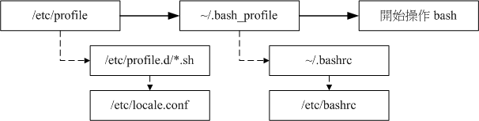

# Bash 与 Shell Scripts

## 认识Bash

### 1. 什么是Bash

Bash 是Unix 和 Linux系统的一种Shell（命令行环境），当前大多数Linux发行版本默认为Shell。

Shell 是什么？
1）命令行环境（CLI：command line interface) 
shell 跟kernel进行交互的对话界面。 shell接收到用户指令信息后传输给kernel，并将结果返回给用户。

2）命令解释器
shell 解释用户输入的命令，支持变量、条件判断、循环等语法。

### 2. Bash Shell的种类

Shell 根据发布者不同具有不同的版本：

- Bournel Shell(sh) 
- Bournel Again Shell(bash)  - 在sh基础上的增强版本，并已成为Linux默认的Shell。
- C Shell(csh)
- Korn shell(ksh)  - 商业常用到的shell
- Tenex C Shell(tcsh) - 整合了csh，能提供更多的功能。

在/etc/shells文件中可以查看当前系统的shell。

```shell
# 查看当前系统默认的shell
[root@ ~]# echo $SHELL
/bin/bash

# 查看当前系统中的sh
[root@ ~]# cat /etc/shells

/bin/sh 
/bin/bash
/usr/bin/sh
/usr/bin/bash
/bin/zsh
```

### 3. Bash Shell的优点

- 历史命令（history）
- 命令与文件补全功能（[Tab]的使用）
- 命令别名设置（alias）
- 任务管理、前台、后台控制（job control, foreground, background)
- 程序化脚本（shell scripts）
- 通配符（wildcard）

### 4. Bash的环境配置

#### Linux 登陆信息配置

- /etc/issue : 在Linux中使用终端登录时，显示的欢迎信息
- /etc/issue.net : 通过telnet远程登录时候，显示的欢迎信息
- /etc/motd : 用户登陆时候显示一些信息。

#### Bash 环境配置文件

1. login shell 与 non-login shell

- login shell：取得 bash 时需要完整的登陆流程的，就称为login shell
- non-login shell：取得 bash 接口的方法不需要重复登陆的举动

2. login shell 模式

- bash 配置文件介绍

> /etc/profile: 系统整体配置文件，不建议用户修改
～/.bash_profile 或 ~/.bash_login 或 ~/.profile 属于用户配置文件
/etc/profile.d/*.h 在CentOS7.x中，概目录下的文件规范了bash操作接口的颜色、语法等等
/etc/locale.conf 该文件设置bash默认使用的语言（例如：LANG="en_US.UTF-8"）
/usr/share/bash-completion/completions/* 在该目录下设置命令补全、文件名补全、命令参数补全功能。

- bash 读取文件顺序

在bash读取完/etc/profile之后，在login shell的bash环境中，将依序分别读其中一个文件：

>a. ~/.bash_profile
b. ~/.bash_login
c. ~/.profile



- source：读入环境配置文件命令

```shell
[root@ ~]# source 配置文件名

#例如
[root@ ~]# source ~/.bashrc
```

3. non-login shell 模式

在 non-login shell模式下，仅读取~/.bashrc文件。

## Shell Scripts

### HelloWorld.sh 的执行

- helloworld.sh

```shell
#!/bin/bash
PATH=/usr/local/lib/nodejs/node-v16.14.2-linux-x64/bin:/usr/local/python310/bin:/usr/local/sbin:/usr/local/bin:/usr/sbin:/usr/bin:/root/bin:/usr/local/mysql/bin:/root/bin

#---主程序---
export PATH
echo -e "Hello World! \a \n"

#---程序结束---
exit 0
```

>脚本说明
> #!/bin/bash - 脚本的解释器位置
> PATH - 系统主要的环境变量

- 脚本赋权

```shell
# 对Scripts脚本赋权
[root@ ~]# chomd a+x hello.sh

[root@ ~]# chomd 755 hello.sh
```

- 脚本执行

Scripts的执行方式：sh script、 ./script

1. sh script执行方式

```shell
[root@ ~]# sh hello.sh
```

2. ./script执行方式

```shell
[root@ ~]# ./hello.sh
```

### 变量

#### 环境变量

env指令：查看环境变量
set指令：查看所有变量（包括环境变量、自定义变量）
export：自定义变量转化为环境变量

#### 变量读取与赋值

变量取值：echo
变量赋值：read、array、declare

变量设置规则：

#### 变量的作用域

环境变量 与 自定义变量 对应类似 全局变量 与 局部变量

#### 变量内容删除、取代与替换

- 变量内容的删除与取代

- 变量的测试与内容替换

#### Shell Script的默认变量 (\$0,$1...）

在输了执行script时，后续可以紧跟 相关参数

```shell
[root@ ~]# /etc/init.d/network restart
```

比如：

/path/to/scriptname  opt1  opt2  opt3  opt4
       $0             $1    $2    $3    $4

- $# ：代表后接的参数“个数”，以上表为例这里显示为“ 4 ”；
- $@ ：代表“ "$1" "$2" "$3" "$4" ”之意，每个变量是独立的（用双引号括起来）；
- $* ：代表“ "$1c$2c$3c$4" ”，其中 c 为分隔字符，默认为空白键， 所以本例中代表“ "$1 $2 $3 $4" ”之意

### 条件判断

#### if...then 结构

- 语法结构

```shell
# 单个条件结构
if [ 条件判断式 ]; then
    当条件判断式成立时，可以进行的指令工作内容；
fi

# 2个条件结构
if [ 条件判断式 ]; then
    当条件判断式成立时，可以进行的指令工作内容；
else
    当条件判断式不成立时，可以进行的指令工作内容；
fi

# 3个以上条件结构
if [ 条件判断式1 ]; then
    当 条件判断式1 成立时，可以进行的指令工作内容；

elif [条件判断式2 ]; then
    当 条件判断式2 成立时，可以进行的指令工作内容；

else
    当 条件判断式1和2 都不成立时，可以进行的指令工作内容；
fi

```

- 语法说明

1. 条件判断式： & 代表 AND ； || 代表 or ；

#### case ... esac 结构

- 语法结构

```shell
case $变量 in

    "变量值1")
        程序段
        ;;
    "变量值2")
        程序段
        ;;
    *)
        ”变量“在”变量值1、2...“都不包含的情况下，执行程序段
        exit 1
        ;;
esac
```

- 语法说明


#### test命令

```shell
[root@ ~]# test expression
```

test命令在直接执行时候，将无信息返回；所以，test命令的 “expression“ 常与 || 和 && 一起使用。

```shell
[root@ ~]# test -e /test && echo "exit" || echo "Not exit"
```

#### 判断符号 [ ]

判断符号[ ]  有以下2种方式，其可以用到 if 判断 以及 test命令中。

```shell
# 表达式一
[ expression ]

# 表达式二
[[ expression ]]

```

表达式一、表达式二功能作用都一样用于对语句的判断，但仅有 “表达式二” 可以使用 正则表达式。

#### 判断表达式

在 expression 中，经常判断表达式：

- 文件判断
- 字符串判断
- 整数判断
- 正则判断
- 算术判断
- 普通命令的逻辑计算

### 循环

在bash中循环语法：while、until、for三种方式。

#### while do done 结构

- 语法结构

```shell
while condition; do
    commands
done
```

- 语法说明

1. condition 是“判断表达式”

2. “判断表达式”与if的一样，可以使用test命令、可以使用“判断符号”等；

3. condition 若条件为符合规则，则执行 commands 内容；

#### until do done 结构

- 语法结构

```shell

util condition; do
    commands
done

```

- 语法说明

#### for 结构

- 语法结构

```shell
for (( 初始值; 限制值; 执行步长))
do
    commands
done
```

- 语法说明

1. 初始值： 初始化循环条件； 限制值：界定循环结束的条件； 执行步长：每次循环迭代的末尾执行，用于更新值

2. 圆括号之中使用变量，不必加上美元符号$

#### for...in 结构

- 语法结构

```shell

for var in con1 con2 con3...
do
    commands
done
```

- 语法说明

1. 对 con1、con2、con3 进行一次循环；

2. 每次循环变量var对应相应的值；

#### break, continue

break, continue 用来在循环内跳出循环。

break命令 立即终止循环， 程序继续执行循环块外的语句，即循环终止。

continue命令 立即终止本轮循环， 开始执行下一轮循环。

### 函数

```shell
function fname(){
    程序段
    return
}

```

- 参数变量

    函数体内可以使用参数变量，获取函数参数。函数的参数变量，与脚本参数变量是一致的。

    `$1`~`$9`：函数的第一个到第9个的参数。
    `$0`：函数所在的脚本名。
    `$#`：函数的参数总数。
    `$@`：函数的全部参数，参数之间使用空格分隔。
    `$*`：函数的全部参数，参数之间使用变量`$IFS`值的第一个字符分隔，默认为空格，但是可以自定义。

- return 返回值
    `return`命令用于从函数返回一个值，函数将不再继续执行。

- 函数中变量作用范围

    Bash 函数体内直接声明的变量，属于全局变量，整个脚本都可以读取

    函数里面可以用`local`命令声明局部变量


### Shell Scripts的Debug

```shell
[root@ ~]$ sh [-nvx] scripts.sh
选项与参数：
-n  ：不要执行 script，仅查询语法的问题；
-v  ：再执行 sccript 前，先将 scripts 的内容输出到屏幕上；
-x  ：将使用到的 script 内容显示到屏幕上，这是很有用的参数！
```

## 常用到的命令

- echo 指令：获取环境变量值
- env、set 指令：查看环境变量信息
- export指令：将自定义变量转化为环境变量
- ulimit 指令：对文件系统及程序的限制设置
- alias、unalias 指令：命令别名设置
- histroy指令：查看历史指令

## 实战练习

# 参考

1、[Bash 脚本教程](https://wangdoc.com/bash/index.html)

2、鸟叔的Linux私房菜-基础学习篇