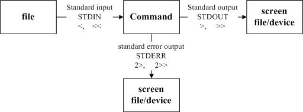
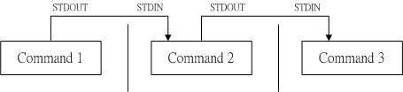

# 数据流重定向



## 标准输入与标准输出

标准输入 standard input ： < 与 <<
标准输入指将原本需要由键盘输入的数据，改由文件内容来取代。


标准输出（STDOUT）指的是“指令执行所回传的正确的信息”
标准错误输出（STDERR）可理解为“ 指令执行失败后，所回传的错误信息”

标准输入　　（stdin） ：代码为 0 ，使用 < 或 << ；
标准输出　　（stdout）：代码为 1 ，使用 > 或 >> ；
标准错误输出（stderr）：代码为 2 ，使用 2> 或 2>>

1> ：以覆盖的方法将“正确的数据”输出到指定的文件或设备上；
1>>：以累加的方法将“正确的数据”输出到指定的文件或设备上；
2> ：以覆盖的方法将“错误的数据”输出到指定的文件或设备上；
2>>：以累加的方法将“错误的数据”输出到指定的文件或设备上；

写入同一个文件的特殊语法如上表所示，你可以使用 2>&1 也可以使用 &> ！

```shell

# 将指令的数据全部写入名为 list 的文件中
[dmtsai@study ~]$ find /home -name .bashrc > list 2> list  <==错误
[dmtsai@study ~]$ find /home -name .bashrc > list 2>&1     <==正确
[dmtsai@study ~]$ find /home -name .bashrc &> list         <==正确

```

- 标准输入和输出 应用场景

屏幕输出的信息很重要，而且我们需要将他存下来的时候；
背景执行中的程序，不希望他干扰屏幕正常的输出结果时；
一些系统的例行命令 （例如写在 /etc/crontab 中的文件） 的执行结果，希望他可以存下来时；
一些执行命令的可能已知错误讯息时，想以“ 2> /dev/null ”将他丢掉时；
错误讯息与正确讯息需要分别输出时。


## ; , && , || 的使用

- 符号：； - 不考虑指令相关性连续下达指令

```shell
[root@ ~]# sync; sync; shutdown -h now
```

- $? ，&& ，||

|指令|指令说明|
|:---|:---|
|$?| 是指指令回传的指|
|command1 && command2| 1） 若 cmd1 执行完毕且正确执行（$?=0），则开始执行cmd2。 <br> 2） 若 cmd1 执行完毕且为错误 （$?≠0），则 cmd2 不执行。|
|command1 \|\| command2|1) 若 cmd1 执行完毕且正确执行（$?=0），则cmd2不执行。 <br> 2）若 cmd1 执行完毕且为错误 （$?≠0），则开始执行cmd2。|

```shell

# command1 && command2 举例：使用ls查看/tmp/abc目录是否存在，若存在则新建abc目录
[root@~]# ls /tmp/abc && touch /tmp/abc/hehe
ls: 无法访问/tmp/abc: 没有那个文件或目录
[root@~]# mkdir /tmp/abc
[root@~]# /tmp/abc && touch /tmp/abc/hehe
[root@~]# ll /tmp/abc
总用量 0
-rw-r--r--. 1 root root 0 7月  21 13:42 hehe

# command1 || command2 举例：使用ls查看tmp/abc目录是否存在，若不存在则创建abc目录，若存在则不做操作
[root@~]# ls /tmp/abc || mkdir /tmp/abc
ls: 无法访问/tmp/abc: 没有那个文件或目录
[root@~]# ll -d /tmp/abc
drwxr-xr-x. 2 root root 6 7月  21 13:51 /tmp/abc

# command1 || command2 && command2 举例：在ls查看/tmp/abc目录不存在时，则新建abc目录；新建hehe文件。
[root@~]# ls /tmp/abc || mkdir /tmp/abc && touch /tmp/abc/hehe
ls: 无法访问/tmp/abc: 没有那个文件或目录
[root@~]# ll -d /tmp/abc                                     
drwxr-xr-x. 2 root root 18 7月  21 13:53 /tmp/abc
[root@~]#ls /tmp/abc
hehe
```

# 管道命令(pipe)



## 什么是管道命令

管道命令 使用符号：“｜” 做界定符号。
管道命令 仅能 接收 前一个指令返回的“正确信息“（standard output），对错误信息无法处理（standard error）。

## 常用的管道命令

- 选取命令： cut、grep
- 排序命令： sort、wc、uniq
- 双向重定向： tee
- 字符转换命令： tr、col、join、paste、expand
- 划分命令：split
- 参数代换：xargs
